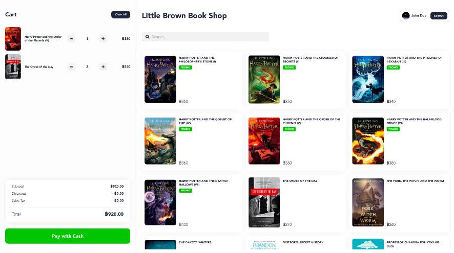
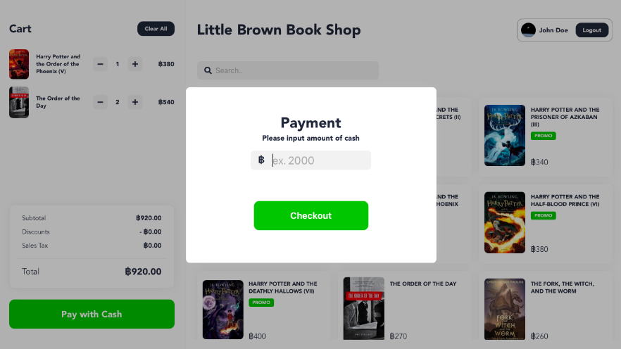
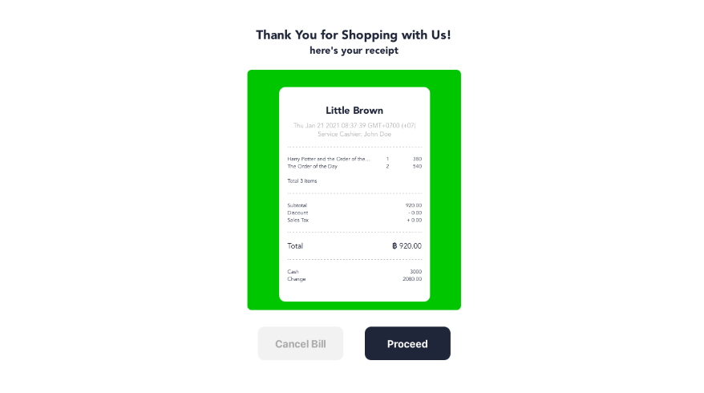
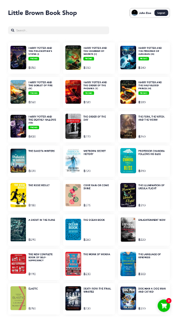
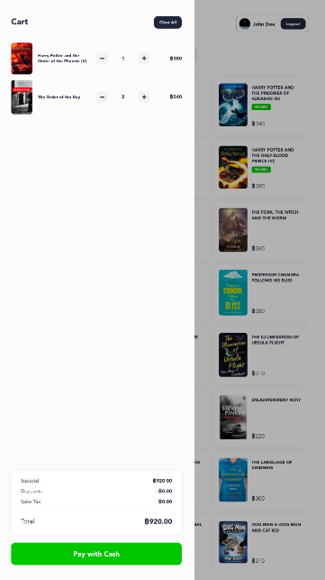
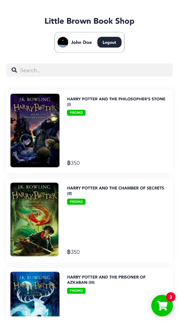
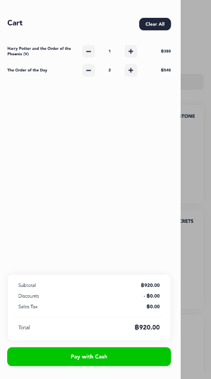

# Little Brown Book Shop

## Index
1. [Description](#description)
2. [Screenshots](#screenshots)
3. [Deployment Notes](#deployment-notes)
4. [Project Setup](#project-setup)

## Description
This repository stores the implementation for *Little Brown Book Shop*'s POS system based on the requirement from LINE Frontend Interview.

Developed on Safari 14.0.2 ; Tested on Safari 14.0.2 and Google Chrome Version 87.0.4280.141


Live Demo: https://littlebrownies.herokuapp.com

> **Note**: Please **disable Cross-origin Restriction** on browser when visiting the live demo (or please allow CORS on the server side). Go to `Develop > Disable Cross-Origin Restrictions` in Safari, or checkout [this extension](https://chrome.google.com/webstore/detail/allow-cors-access-control/lhobafahddgcelffkeicbaginigeejlf) for Google Chrome.

## Screenshots

Little Brown's POS consists of three main view elements for three main process -- Adding books from book list to the cart, Payment, and Displaying receipt

| View | Screenshot |
|----------|------------------|
| Book List |  |
| Payment |  |
| Receipt |  |


The webpage is also responsive to several screen dimensions. Check it out!

| View | Screenshot |
|----------|------------------|
| Desktop |  | 
| Tablet |   |
| Mobile  |   |


## Deployment Notes
Configuration for environment variables is required to deploy this project. Please see .env.example.

| Variables             | Description                                                                                                                        | Example                                              |
|-----------------------|------------------------------------------------------------------------------------------------------------------------------------|------------------------------------------------------|
| VUE_APP_BOOK_LIST_API | API endpoint to retrieve list of books                                                                                             | https://json-bin.netlify.com/books.json (Production) |
| VUE_APP_LIFF_CDN      | Endpoint for LIFF cdn                                                                                                              | https://static.line-scdn.net/liff/edge/2/sdk.js      |
| VUE_APP_LIFF_ID       | LIFF ID for initiating LIFF                                                                                                        |                                                      |
| VUE_APP_TEST_USER     | set to `TRUE` on local development to bypass LINE Authentication. Leave blank for production to deploy with authentication enabled |                                                      |

## Project setup
```
npm install
```

### Compiles and hot-reloads for development
```
npm run serve
```

### Compiles and minifies for production
```
npm run build
```
### Lints and fixes files
```
npm run lint
```

### Run your unit tests
```
npm run test:unit
```

### Customize configuration
See [Configuration Reference](https://cli.vuejs.org/config/).
